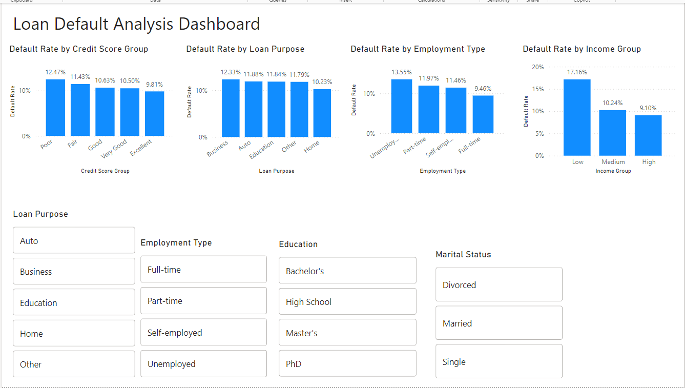

# Loan Default Analysis Dashboard

## Overview
This project presents an interactive Power BI dashboard developed to analyze loan default trends and identify high-risk customer segments. The dashboard supports data-driven decision-making through interactive visualizations, KPIs, and business insights.

## Tools
- Power BI
- DAX
- Microsoft Excel

## Features
- Interactive dashboard
- KPI tracking
- Customer segmentation
- Loan default trend analysis
- Business insights and recommendations

## Key Insights
- Identified high-risk customer segments.
- Analyzed loan default trends.
- Developed KPIs to monitor business performance.
- Prepared an analytical report with findings and recommendations.

## Repository Contents
- `Loan Default Analysis.pbix`
- `Dashboard.png`
- `Report.png`

